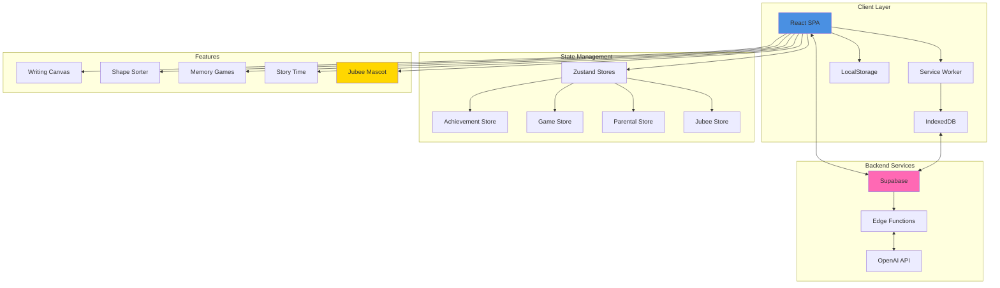
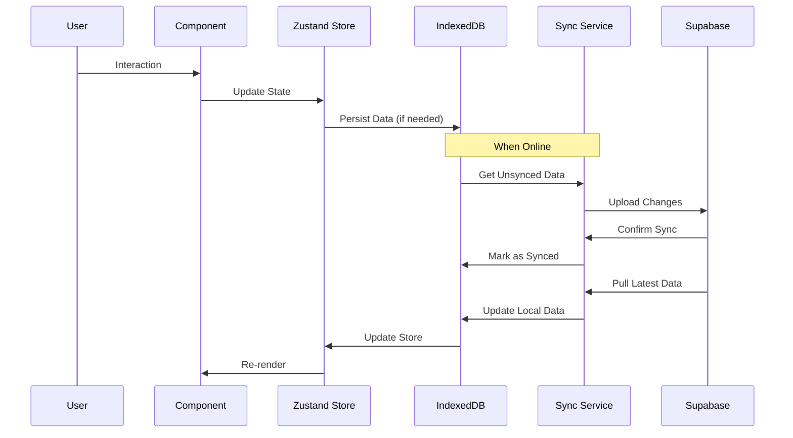
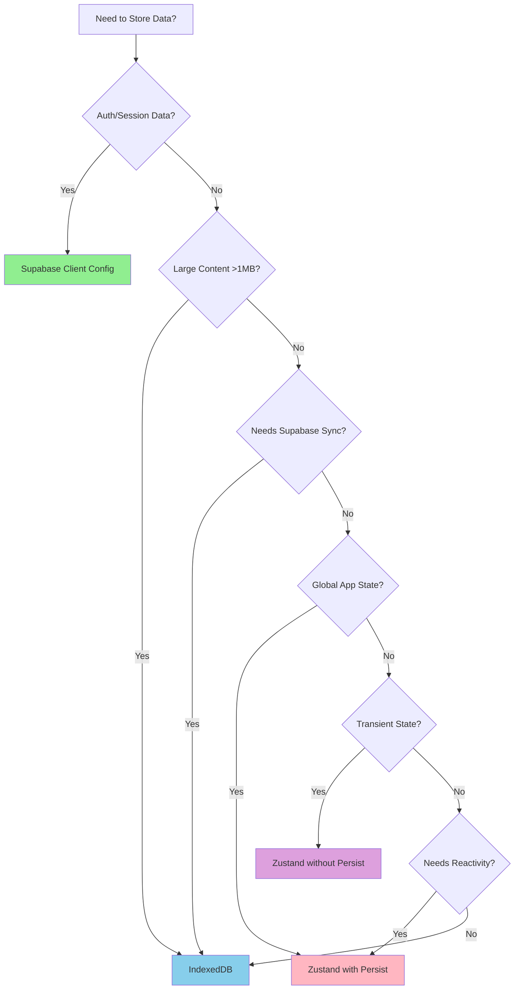
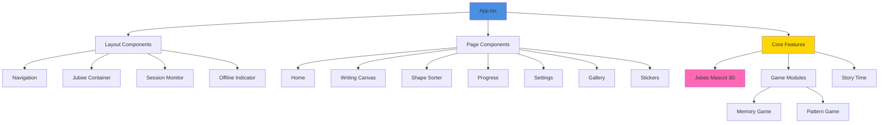
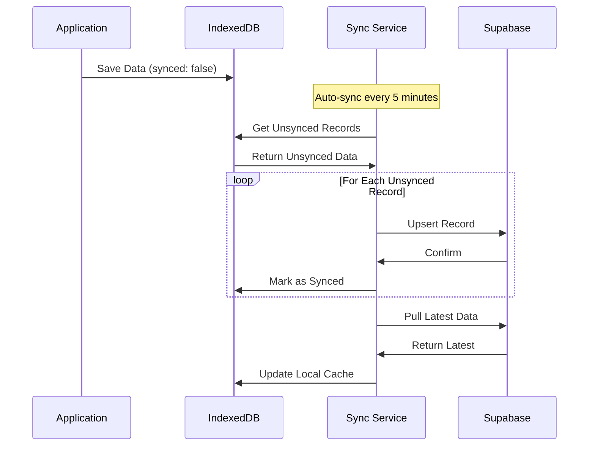
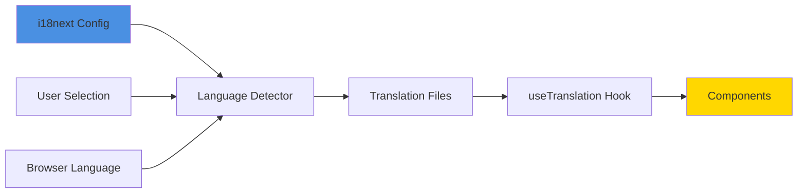

# Jubee Love - Architecture Documentation

## Table of Contents
1. [System Overview](#system-overview)
2. [Architecture Diagrams](#architecture-diagrams)
3. [Technology Stack](#technology-stack)
4. [Storage Architecture](#storage-architecture)
5. [Component Architecture](#component-architecture)
6. [Performance Optimization](#performance-optimization)
7. [Security & Error Handling](#security--error-handling)

---

## System Overview

Jubee Love is an offline-first, progressive web application (PWA) designed for early childhood education. The application features an AI-powered mascot "Jubee" that guides children through interactive learning activities including writing practice, shape sorting, games, and reading.

### Key Characteristics
- **Offline-First**: Full functionality without internet connection
- **Progressive Web App**: Installable, works like a native app
- **Multi-Language Support**: English, Spanish, French, Mandarin, Hindi
- **AI-Powered**: OpenAI integration for conversational AI and voice features
- **Child-Friendly**: Designed for ages 3-7 with parental controls

---

## Architecture Diagrams

### High-Level System Architecture



### Data Flow Architecture



### Storage Decision Flow



### Component Hierarchy



---

## Technology Stack

### Frontend
- **Framework**: React 18.3.1 with TypeScript
- **Build Tool**: Vite
- **Styling**: Tailwind CSS with semantic design tokens
- **3D Graphics**: Three.js with React Three Fiber
- **State Management**: Zustand with persist middleware
- **Routing**: React Router DOM
- **UI Components**: Radix UI primitives with shadcn/ui

### Backend & Services
- **Backend**: Supabase (PostgreSQL, Auth, Storage, Edge Functions)
- **AI Services**: OpenAI (GPT-4 mini, TTS HD, Whisper)
- **Internationalization**: i18next, react-i18next
- **Offline Support**: IndexedDB with custom sync service

### Development & Build
- **Package Manager**: npm/bun
- **Linting**: ESLint
- **Type Checking**: TypeScript
- **PWA**: vite-plugin-pwa with Workbox

---

## Storage Architecture

### Three-Tier Storage Strategy

#### 1. Zustand with Persist Middleware
**Purpose**: Application state requiring reactivity across sessions

**Stores**:
- `useGameStore` → Game state, scores, themes
- `useParentalStore` → Child profiles, parental controls
- `useAchievementStore` → Achievement progress and unlocks
- `useJubeeStore` → Runtime mascot state (NOT persisted)

**Storage Key**: `jubeelove-{store-name}-storage` in localStorage

**Best For**:
- User preferences and settings
- Global application state
- Small, frequently accessed data
- Data requiring reactive updates

#### 2. IndexedDB (jubeeDB Service)
**Purpose**: Structured data with offline sync capabilities

**Object Stores**:
- `gameProgress` - Game session data
- `achievements` - Achievement unlocks
- `drawings` - Canvas artwork with metadata
- `stickers` - Unlocked sticker data
- `childrenProfiles` - Child profile data for offline access

**Best For**:
- User-generated content (drawings)
- Large datasets (>5MB)
- Data requiring Supabase sync
- Structured queries with indexes

#### 3. Direct localStorage
**Usage**: DEPRECATED - Reserved only for third-party libraries

**Current Usage**:
- Supabase auth tokens (managed by Supabase)
- i18next language preference (managed by i18next)

### Sync Service Architecture



**Key Features**:
- Automatic bidirectional sync every 5 minutes when online
- Manual sync trigger via UI
- Conflict resolution (server wins)
- Retry logic with exponential backoff
- Sync status tracking per record

---

## Component Architecture

### Heavy Components & Optimization

#### 1. JubeeMascot (3D Component)
**Optimization Strategies**:
- Memoized color constants
- Reusable Three.js vector objects
- Efficient `useFrame` animation loop
- Conditional rendering for speech bubbles
- Optimized geometry with appropriate segment counts

**Performance Profile**:
- Target: <16ms per frame (60fps)
- Average render: ~8-12ms
- Monitored with React Profiler

#### 2. WritingCanvas
**Optimization Strategies**:
- Canvas rendering outside React lifecycle
- Event handler debouncing for draw operations
- Efficient context reuse
- Async save operations with IndexedDB
- Error boundaries for graceful degradation

**Performance Profile**:
- Target: <100ms for save operations
- Target: <5ms for draw operations
- Monitored touch/mouse event latency

#### 3. Game Modules (Memory, Pattern)
**Optimization Strategies**:
- Memoized game state calculations
- Lazy loading of game assets
- Virtual scrolling for large item lists
- Throttled animation frame requests

---

## Performance Optimization

### Performance Monitoring System

```typescript
// Performance tracking enabled in development
const performanceMonitor = new PerformanceMonitor({
  logToConsole: process.env.NODE_ENV === 'development',
  warningThreshold: 16, // 60fps = 16ms
});

// Wrap heavy components
const ProfiledJubee = withPerformanceMonitor(
  JubeeMascot,
  'JubeeMascot'
);
```

### Key Metrics Tracked
1. **Component Render Times**
   - Average render duration
   - Render count
   - Slow render warnings (>16ms)

2. **Storage Operations**
   - IndexedDB operation latency
   - Sync success/failure rates
   - Queue depth for unsynced items

3. **Network Performance**
   - API response times
   - Edge function latency
   - Sync batch sizes

### Optimization Checklist
- ✅ React Profiler integrated for heavy components
- ✅ Memoization for expensive calculations
- ✅ Lazy loading for routes and assets
- ✅ Service worker caching for offline assets
- ✅ IndexedDB for large data storage
- ✅ Debounced/throttled event handlers
- ✅ Virtual scrolling for long lists
- ✅ Code splitting with dynamic imports

---

## Security & Error Handling

### Error Handling Philosophy
**"Expect the worst to happen"** - Comprehensive fail-safes throughout

#### Error Boundaries
```typescript
<ErrorBoundary fallback={<ErrorFallback />}>
  <HeavyComponent />
</ErrorBoundary>
```

#### Try-Catch Blocks
All async operations wrapped with error handling:
```typescript
try {
  await riskyOperation();
} catch (error) {
  console.error('Operation failed:', error);
  toast({ title: "Error", variant: "destructive" });
  // Fallback behavior
}
```

#### Retry Logic
Exponential backoff for network operations:
```typescript
const retry = async (fn, retries = 3, delay = 1000) => {
  try {
    return await fn();
  } catch (error) {
    if (retries === 0) throw error;
    await new Promise(r => setTimeout(r, delay));
    return retry(fn, retries - 1, delay * 2);
  }
};
```

### Security Measures
1. **Row Level Security (RLS)** on all Supabase tables
2. **API Key Management** via Supabase secrets
3. **XSS Prevention** via React's default escaping
4. **CSRF Protection** via Supabase auth tokens
5. **Parental Controls** with session time limits
6. **Data Validation** at all input boundaries

---

## Internationalization

### Language Support
- English (en)
- Spanish (es)
- French (fr)
- Mandarin (zh)
- Hindi (hi)

### Translation Architecture


**Translation Scope**:
- UI text and labels
- Jubee speech and greetings
- Error messages and toasts
- TTS voice selection per language

---

## Testing Strategy

### Unit Tests
- Store logic and state mutations
- Utility functions and helpers
- Error handling edge cases

### Integration Tests
- Storage sync workflows
- Component interaction flows
- API integration points

### Performance Tests
- Component render benchmarks
- Storage operation latency
- Animation frame rates

### Manual Testing Checklist
✅ Offline functionality  
✅ Cross-browser compatibility  
✅ Touch vs mouse input  
✅ Parental control flows  
✅ Multi-language switching  
✅ PWA installation  

---

## Best Practices

### Code Quality Standards
1. **TypeScript Strict Mode** - All files strictly typed
2. **ESLint Rules** - Enforced code style
3. **Design Tokens** - No hardcoded colors
4. **Error Handling** - Try-catch on all async operations
5. **Documentation** - JSDoc comments on complex functions
6. **Testing** - 10/10 rubric before committing
7. **Idempotent Operations** - Safe to retry/repeat

### Development Workflow
1. Create feature branch
2. Implement with error handling
3. Add performance monitoring
4. Test against rubric (10/10)
5. Document complex logic
6. Review for regressions
7. Commit and deploy

---

## Future Enhancements

### Performance
- [ ] Virtual scrolling for large galleries
- [ ] Web Worker for heavy calculations
- [ ] Progressive image loading
- [ ] Service worker cache optimization

### Features
- [ ] Multiplayer games
- [ ] Advanced progress analytics
- [ ] Custom activity creation
- [ ] Video lessons integration

### Infrastructure
- [ ] Automated performance regression tests
- [ ] CI/CD pipeline with quality gates
- [ ] Automated accessibility audits
- [ ] Load testing for sync service

---

## References

- [Storage Strategy Documentation](./STORAGE_STRATEGY.md)
- [Offline Storage README](./OFFLINE_STORAGE_README.md)
- [Supabase Documentation](https://supabase.com/docs)
- [React Three Fiber Docs](https://docs.pmnd.rs/react-three-fiber)
- [Zustand Documentation](https://github.com/pmndrs/zustand)
- [i18next Documentation](https://www.i18next.com/)
